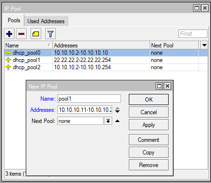
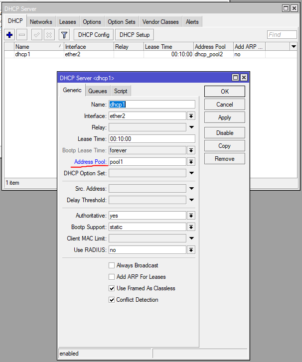
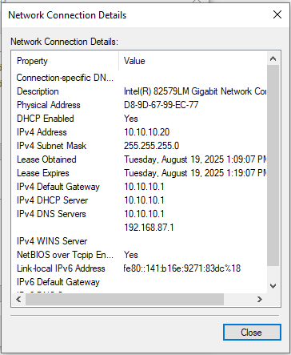
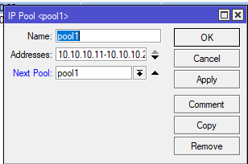
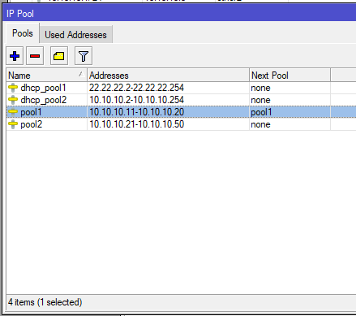

# LAB-30-IP-Pool
Selasa 19 Agustus 2025  

# IP POOL
  IP pool pada adalah fitur untuk menentukan range alamat IP yang akan didistribusikan secara otomatis, terutama melalui DHCP server. IP pool ini membatasi jumlah client yang bisa terhubung dan menggunakan IP address dari range yang telah ditentukan.  

# Konfigurasi IP Pool  
  1. Kita bisa menemukan Ip Pool di **IP > POOL**.  
  
  2. Sekarang buat IP Poolnya, disini saya akan buat *10.10.10.11-10.10.10.20*  

  4. Sekarang cek IP di Client, jika belum masuk range **ipconfig /renew** dulu di cmd.  
  
  5. Sekarang parameter **Next pool**, next pool ini digunakan jika pool1 sudah penuh, maka pool ip akan ke pool yang dipilih. Contohnya seperti kita membuat **pool1** rangenya *10.10.10.11-10.10.10.20* dan pool 2 *10.10.10.21-10.10.10.50*, jika DHCP server mengunakan pool1 dan pool1 sudah terisi/digunakan semua, maka client ke-11 akan mendapat range IP dari **pool2**.  
  6. Pertama kita buat pool lagi untuk next poolnya.  
  
  7. Setelah itu kita masuk ke pool sebelumnya yang sudah dibuat **pool1** lalu masukan **pool2** di **next pool**.  
     
  8. Dan sekarang jika range di pool1 sudah habis, maka client akan diberi IP dari pool2.
       
# Kesimpulan
  Untuk memberi batasan kepada router mengenai range IP Address yang boleh di berikan untuk client pada suatu jaringan, baik untuk client local atau yang lainya.  

# Sumber
Mikrotik - https://help.mikrotik.com/docs/spaces/ROS/pages/129531938/IP+Pools
